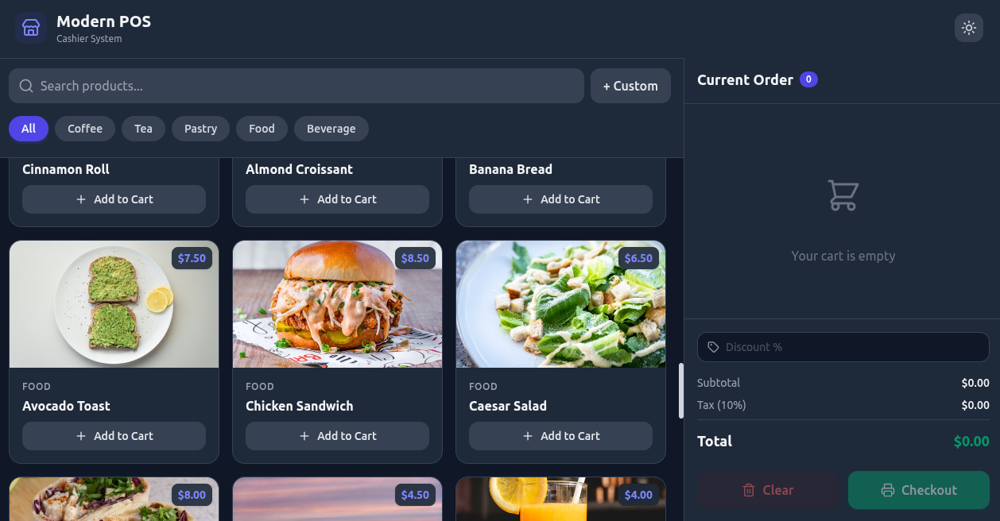

# 🛒 Modern POS Application



Demo Link: https://pos-app-demo.vercel.app/ 

A professional, modern, and fully responsive Point of Sale (POS) frontend web application. Built with **React**, **Vite**, and **Tailwind CSS v4**, this application simulates a real-world cashier system with a beautiful user interface and smooth UX.

## ✨ Features

- **🛍️ Product Grid**: Browse 28+ categorized products.
- **🔍 Quick Search & Filters**: Filter products by category or use the search bar to find exactly what you need.
- **🧾 Dynamic Cart**: Modify item quantities, view per-item subtotal, and easily remove items.
- **🏷️ Discount System**: Apply custom percentage discounts dynamically affecting tax and totals.
- **➕ Custom Items**: Add special or off-menu requests on the fly with a dedicated custom item modal.
- **🖨️ Printable Receipts**: Checkout directly to a physical receipt perfectly formatted for 80mm thermal POS printers.
- **🌙 Dark Mode**: Beautiful dark theme preserved automatically using `localStorage`.
- **⌨️ Keyboard Shortcuts**: Press `Enter` to seamlessly trigger the checkout when the cart has items.

## 🚀 Tech Stack

- **Framework**: [React 19](https://react.dev/) + [Vite](https://vitejs.dev/)
- **Styling**: [Tailwind CSS v4](https://tailwindcss.com/)
- **Icons**: [Lucide React](https://lucide.dev/)
- **Printing**: [React-To-Print](https://github.com/gregnb/react-to-print)

## 🛠️ Getting Started

### Prerequisites
Make sure you have [Node.js](https://nodejs.org/) installed on your machine.

### Installation

1. Clone the repository:
   ```bash
   git clone https://github.com/mohakamran/pos-app.git
   cd pos-app
   ```

2. Install dependencies:
   ```bash
   npm install
   ```

3. Start the development server:
   ```bash
   npm run dev
   ```

## 📂 Project Structure

```text
src/
├── components/
│   ├── CartItem.jsx          # Individual cart line items
│   ├── CartSummary.jsx       # Totals, discount inputs, and checkout actions
│   ├── CustomItemModal.jsx   # Modal for ad-hoc items
│   ├── Header.jsx            # Top navigation and dark mode toggle
│   ├── ProductCard.jsx       # Product grid cards
│   └── Receipt.jsx           # Hidden print-only receipt view
├── App.jsx                   # Main application layout and state
├── data.js                   # Mock product database
├── index.css                 # Global CSS and Tailwind directives
└── main.jsx                  # React DOM entry point
```

## 🤝 Contributing
Contributions, issues, and feature requests are welcome!

## 📝 License
This project is licensed under the MIT License.
